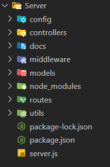

# BuildoRite Setup Guide

## -> New Backend Setup

1.  **Initialize a new Node.js project:**
    ```bash
    npm init
    ```

2.  **Install Production Dependencies:**
    ```bash
    npm install bcryptjs body-parser cloudinary cookie-parser cors dotenv express helmet jsonwebtoken mongoose validator
    ```
    * **bcryptjs:** Password hashing.
    * **body-parser:** Parsing request bodies.
    * **cloudinary:** Cloud media management.
    * **cookie-parser:** Parsing HTTP cookies.
    * **cors:** Cross-Origin Resource Sharing.
    * **dotenv:** Environment variable management.
    * **express:** Web framework.
    * **helmet:** Security headers.
    * **jsonwebtoken:** JWT authentication.
    * **mongoose:** MongoDB object modeling.
    * **validator:** Data validation.

3.  **Install Development Dependencies:**
    ```bash
    npm install --save-dev nodemon
    ```
    * **nodemon:** Automatic server restarts during development.

## -> Setup File Structure (MVC)

1.  **Create directories for MVC (Model-View-Controller) architecture:**
    ```bash
    mkdir middleware controllers models routes utils config
    ```

2.  **Visual Representation:**
    ```
    ├── config/
    ├── controllers/
    ├── middleware/
    ├── models/
    ├── routes/
    ├── utils/
    ├── server.js
    ├── package.json
    ├── package-lock.json
    └── ... (other files)
    ```

    

## -> Create Entry Point (server.js)

1.  Create a `server.js` file in the root directory of your project. This file will be the entry point for your application.
    ```javascript
    // server.js example (basic express setup)
    import app from './app.js';
    import dotenv from 'dotenv';
    import connectDB from './config/database.js';
    import {v2 as cloudinary} from 'cloudinary';

    // Handle uncaught exceptions
    process.on('uncaughtException', (err) => {
        console.error(`Uncaught Exception: ${err.message}`);

        const stackLines = err.stack.split('\n');
        let locationInfo = "Unknown location";

        for (const line of stackLines) {
            if (line.includes('at ')) {
                locationInfo = line.substring(line.lastIndexOf('at ') + 3);
                break;
            }
        }

        console.error(`Error Location: ${locationInfo}`);
        console.log('Shutting down server due to uncaught exception');
        process.exit(1);
    });

    // Setup dotenv
    dotenv.config({path: 'config/.env'});

    // Connect to the database
    connectDB();

    // Configure cloudinary
    cloudinary.config({
    cloud_name: process.env.CLOUDINARY_CLOUD_NAME,
    api_key: process.env.CLOUDINARY_API_KEY,
    api_secret: process.env.CLOUDINARY_API_SECRET,
    });

    // Create server
    const server = app.listen(process.env.PORT, () => {
    console.log(`Server running on port ${process.env.PORT}`);
    });

    // Handle unhandled promise rejections
    process.on('unhandledRejection', (err) => {
    console.error(`Unhandled Rejection: ${err.message}`);
    console.log('Shutting down server due to unhandled promise rejection');
    server.close(() => {
        process.exit(1);
    });
    });

## -> Create app.js in Root ( middlewares & route handling)

1. Create a `app.js` file in the root directory of your project.

    ```javascript
    import express from 'express';
    import cors from 'cors';
    import helmet from 'helmet';
    import cookieParser from 'cookie-parser';
    import fileUpload from 'express-fileupload';
    import path from 'path';

    import errorMiddleware from './middleware/errorMiddleware.js';

    const app = express();

    app.use(cors());
    app.use(helmet());
    app.use(cookieParser());
    app.use(express.json());
    app.use(express.urlencoded({ extended: true }));
    app.use(fileUpload());

    // Serve static files if in production
    if (process.env.NODE_ENV === 'production') {
    app.use(express.static(path.join(__dirname, 'dist')));
        app.get('*', (req, res) => {
            res.sendFile(path.resolve(__dirname, 'dist', 'index.html'));
        });
    }

    app.use(errorMiddleware);

    export default app;